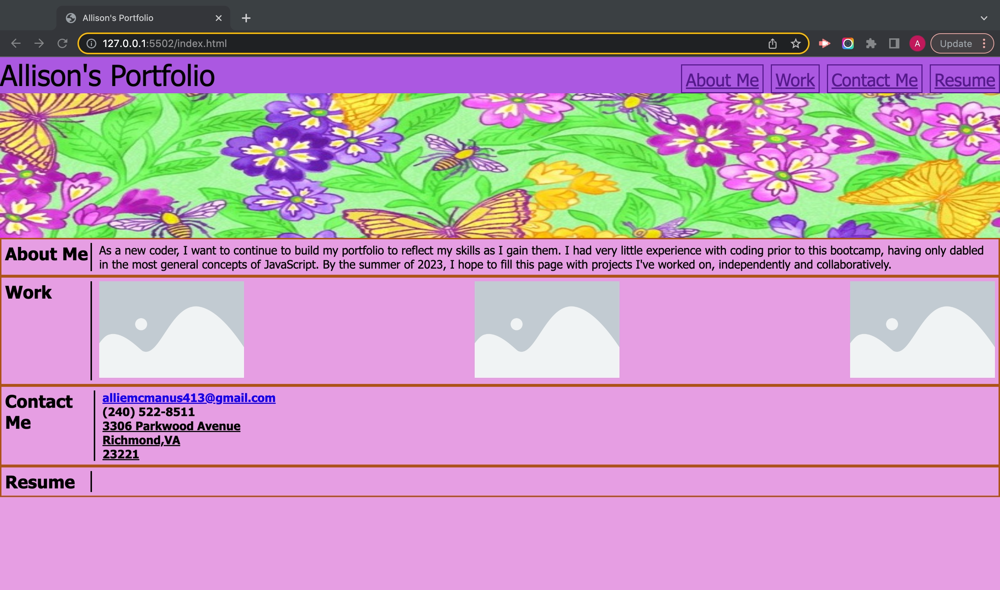

# hw2-css-portfolio

This website will function as my portfolio for my professional coding work as I continue to build my skills. 

As I create more projects, I will update this HTML file to link images to my deployed projects. 

Once I create a professional resume, I will link that in the "resume" section for users to view in pdf format. 

